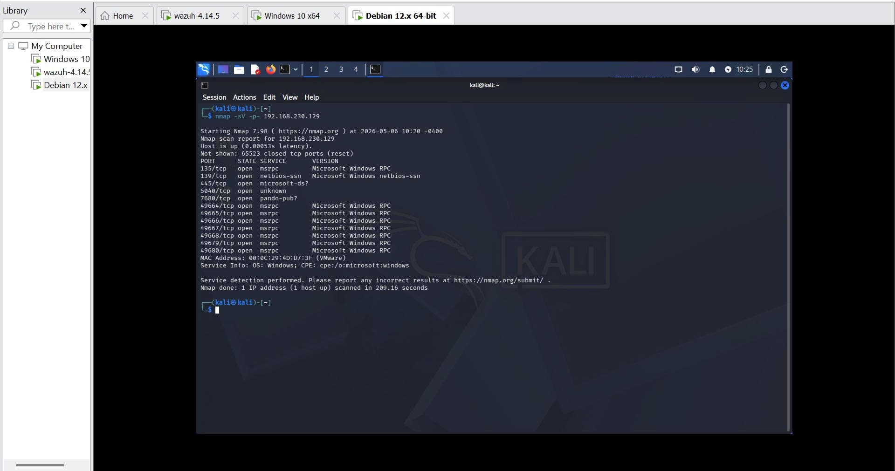
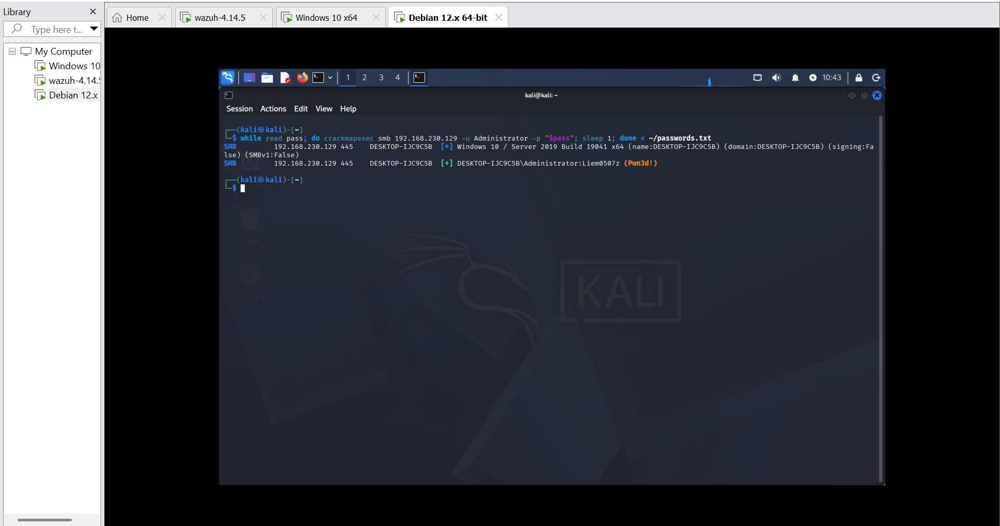
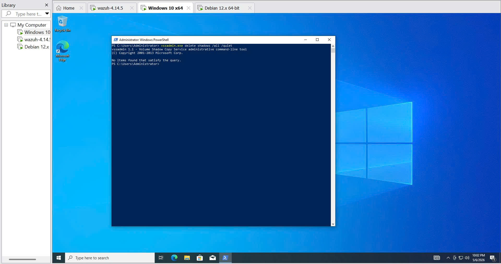
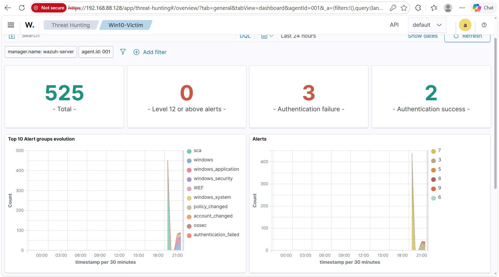
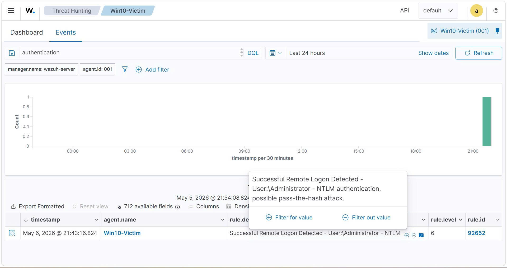
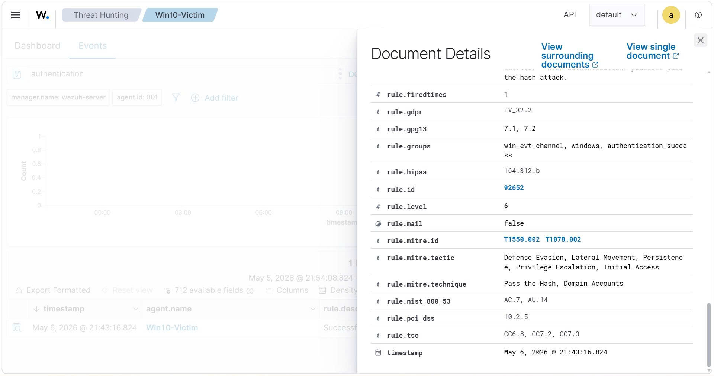
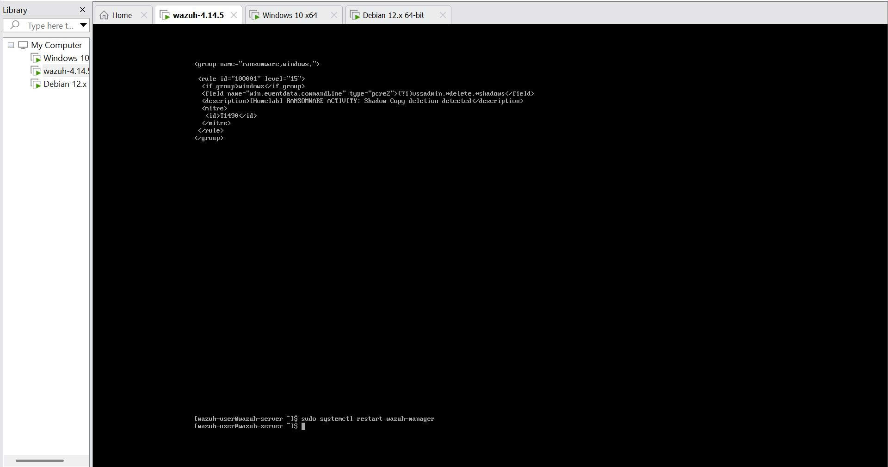
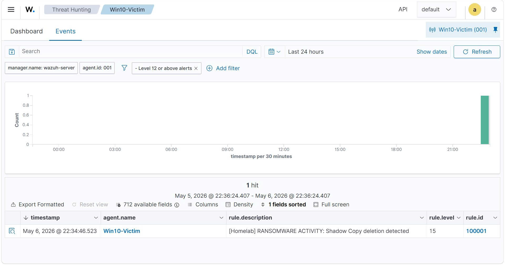

# Wazuh SOC Homelab — Enterprise Endpoint Security Monitoring

> A hands-on Security Operations Center (SOC) lab simulating real-world adversary behaviors and detecting them using Wazuh SIEM/EDR, mapped to the MITRE ATT&CK framework.


---

## 📌 Project Overview

This homelab replicates a corporate network environment to demonstrate the full SOC workflow:

**Threat Emulation → Log Collection → Detection → Alerting → Response**

The lab covers credential-based attacks, lateral movement, and ransomware simulation — all detected and analyzed using Wazuh, with automatic compliance mapping to MITRE ATT&CK, PCI-DSS, NIST 800-53, GDPR, and HIPAA frameworks.

---

## 🏗️ Lab Architecture

| Role | OS | IP Address | Tools |
|------|----|------------|-------|
| **SIEM / EDR Server** | Wazuh OVA 4.14.5 | 192.168.88.128 | Wazuh Manager, Wazuh Indexer, Wazuh Dashboard |
| **Victim / Endpoint** | Windows 10 Pro (x64) | 192.168.230.129 | Wazuh Agent v4.14.5, Audit Policy |
| **Attacker** | Kali Linux (Debian 12) | 192.168.230.132 | Nmap, CrackMapExec, Hydra |

> All virtual machines run on VMware Workstation, connected via NAT Network (`192.168.230.0/24`).

---

## 🎯 Attack Scenarios & Detections

### 1. Reconnaissance — Network Port Scanning
- **Tool:** `nmap -sV -p- <target>`
- **Goal:** Discover open ports and running services on the Windows 10 endpoint
- **Finding:** Port 445 (SMB) exposed after disabling Windows Firewall

### 2. Credential Attack — SMB Brute-Force
- **Tool:** `CrackMapExec`
- **Goal:** Enumerate valid credentials against the SMB service
- **Result:** Successfully authenticated as `Administrator`
- **Wazuh Detection:** Multiple authentication failures (Event ID 4625) + Successful logon

### 3. Lateral Movement — Pass-the-Hash (NTLM)
- **MITRE ATT&CK:** `T1550.002` — Pass the Hash
- **Tactics:** Defense Evasion, Lateral Movement, Privilege Escalation, Initial Access, Persistence
- **Wazuh Rule ID:** `92652` — Level 6
- **Compliance:** PCI-DSS 10.2.5 | NIST AC.7, AU.14 | GDPR IV_32.2 | HIPAA 164.312.b

### 4. Impact — Ransomware Simulation (Shadow Copy Deletion)
- **Command:** `vssadmin.exe delete shadows /all /quiet`
- **Goal:** Simulate ransomware behavior by destroying Windows backup snapshots
- **MITRE ATT&CK:** `T1490` — Inhibit System Recovery
- **Custom Rule Triggered:** `[Homelab] RANSOMWARE ACTIVITY: Shadow Copy deletion detected` — **Level 15**

---

## 📸 Screenshots

### Lab Setup

*Wazuh Agent successfully connected and Active on Win10-Victim endpoint*

### Attack Simulation
| Nmap Scan | SMB Brute-Force |
|-----------|----------------|
|  |  |


*Shadow Copy deletion command executed on Windows 10 — simulating ransomware behavior*

### Wazuh Detection & Alerting

*Wazuh Dashboard showing 525 total events with authentication failures spiking at time of attack*


*Wazuh detecting NTLM-based authentication and flagging potential Pass-the-Hash attack*


*Automatic MITRE ATT&CK technique mapping: T1550.002 (Pass the Hash) with multi-framework compliance*

### Custom Detection Rule

*Custom XML detection rule written in Wazuh local_rules.xml*


*Custom rule triggered at Level 15 (Critical) — highest severity in Wazuh*

---

## 🔧 Custom Detection Rule

```xml
<group name="ransomware,windows,">
  <rule id="100001" level="15">
    <if_group>windows</if_group>
    <field name="win.eventdata.commandLine" type="pcre2">(?i)vssadmin.*delete.*shadows</field>
    <description>[Homelab] RANSOMWARE ACTIVITY: Shadow Copy deletion detected</description>
    <mitre>
      <id>T1490</id>
    </mitre>
  </rule>
</group>
```

---

## 📁 Repository Structure

```
Wazuh-SOC-Homelab/
├── README.md
├── network_topology.png
├── custom_rules/
│   └── detect_shadow_copy_deletion.xml
├── docs/
│   ├── 01_setup_and_config.md
│   ├── 02_attack_simulation.md
│   └── 03_detection_and_rule.md
└── images/
    ├── setup/
    ├── attacks/
    └── detections/
```

---

## 🛠️ Tools & Technologies


---

## 📚 Documentation

- [Setup & Configuration](./docs/01_setup_and_config.md)
- [Attack Simulation](./docs/02_attack_simulation.md)
- [Detection & Custom Rules](./docs/03_detection_and_rule.md)
