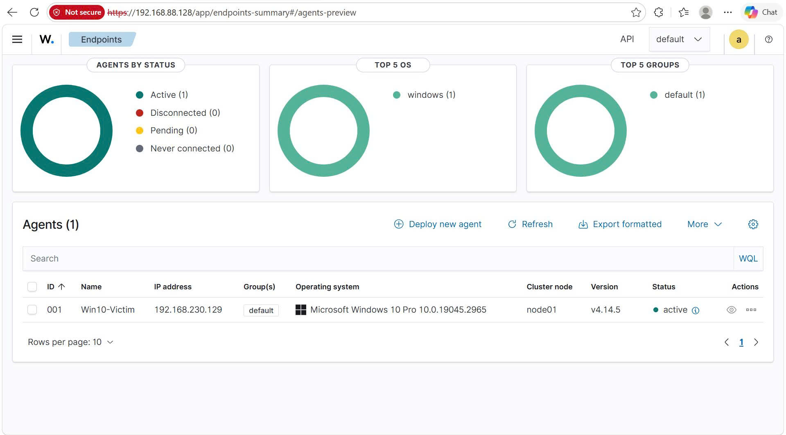

# 01 — Lab Setup & Configuration

## Overview

This document describes the step-by-step configuration of the Wazuh SOC Homelab, including the SIEM server deployment and endpoint agent installation.

---

## 1. Environment

| Component | Specification |
|-----------|--------------|
| Hypervisor | VMware Workstation |
| Network Mode | NAT Network (`192.168.230.0/24`) |
| SIEM Version | Wazuh 4.14.5 (OVA) |
| Endpoint OS | Windows 10 Pro x64 (Build 19041) |
| Attacker OS | Kali Linux (Debian 12) |

---

## 2. Wazuh Server Deployment

The Wazuh server was deployed using the official **pre-built OVA (Open Virtual Appliance)**, which bundles:
- **Wazuh Manager** — core engine for log analysis and rule matching
- **Wazuh Indexer** — Elasticsearch-based log storage
- **Wazuh Dashboard** — Kibana-based web interface

### Steps:
1. Downloaded `wazuh-4.14.5.ova` from the official Wazuh documentation page
2. Imported into VMware Workstation via **File → Open**
3. Configured VM settings: **8GB RAM**, **2 CPU cores**
4. Powered on the VM and retrieved the IP address: `192.168.88.128`
5. Accessed the web dashboard at `https://192.168.88.128`

**Default credentials for the OVA:**
- SSH Login: `wazuh-user` / `wazuh`
- Dashboard: `admin` / `admin`

---

## 3. Wazuh Agent Installation on Windows 10

### Pre-requisite: Enable Windows Audit Policy
To ensure Windows logs process creation events with full command line details:

```powershell
# Enable process creation auditing
auditpol /set /subcategory:"Process Creation" /success:enable /failure:enable

# Enable command line logging in Event ID 4688
reg add HKLM\Software\Microsoft\Windows\CurrentVersion\Policies\System\Audit /v ProcessCreationIncludeCmdLine_Enabled /t REG_DWORD /d 1 /f
```

### Agent Installation:
1. On the Wazuh Dashboard, navigated to **Endpoints → Deploy new agent**
2. Selected **Windows** as the OS
3. Entered the Wazuh Server address: `192.168.88.128`
4. Set the Agent Name: `Win10-Victim`
5. Copied the auto-generated PowerShell command
6. Ran the command on Windows 10 PowerShell (Administrator)
7. Started the agent service:

```powershell
NET START WazuhSvc
```

### Result:

After installation, the agent appeared on the Wazuh Dashboard with status **Active**.



---

## 4. Network Configuration

- Windows Firewall was **disabled** on the victim machine to simulate an exposed enterprise endpoint:

```powershell
netsh advfirewall set allprofiles state off
```

- All VMs share the same NAT network subnet, allowing full communication between attacker, victim, and SIEM server.
